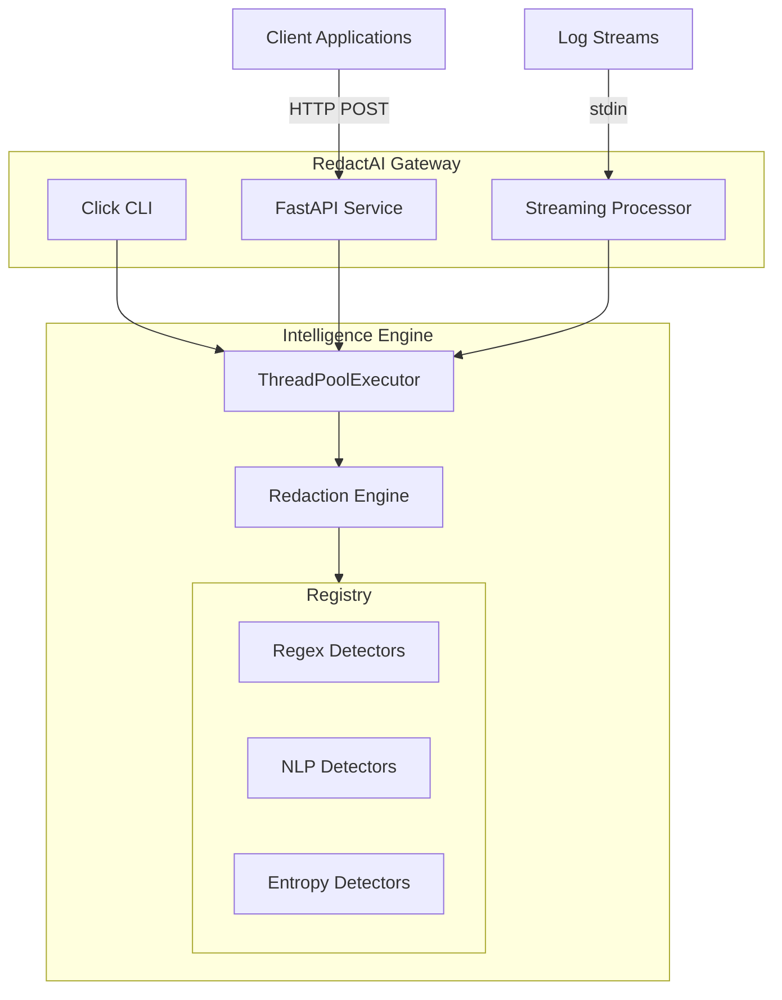
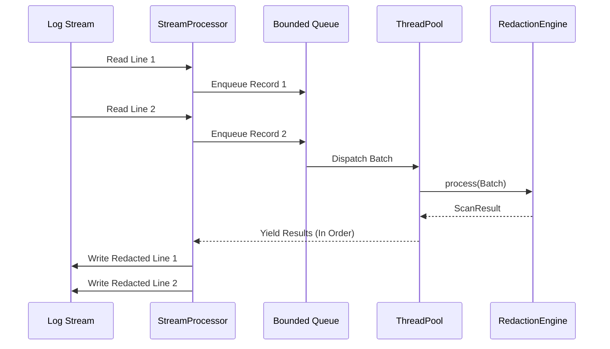

# Architecture

RedactAI is built in two distinct layers: the **Intelligence Engine** and the **Enterprise Gateway**.

## 1. High-Level System Overview



## 2. Module Responsibilities

### `redactai.engine`
- **Detectors**: A suite of classes inheriting from `Detector`. Contains all logic for finding sensitive text (Regex, Luhn checks, Shannon entropy, SpaCy/Presidio).
- **Scrubber**: The `RedactionEngine` handles resolving overlapping detections (e.g., if a JWT token contains an email address, which one wins?). It provides the string-manipulation logic to replace text.
- **Risk & Compliance**: Maps detections to specific compliance frameworks (GDPR, PCI) and calculates a document-level risk score.

### `redactai.gateway`
- **Concurrency**: Wraps the engine in a `ThreadPoolExecutor` bounded by a sliding window queue to prevent Out-Of-Memory (OOM) errors during massive file ingestions.
- **API**: A FastAPI web server that exposes `/scan`, `/stream`, and `/ingest` endpoints.
- **Ingestion Engine**: Batch processes CSV, JSON, and raw text.
- **Observability**: Prometheus metrics (`rg_records_processed`, `rg_queue_depth`) and structured JSON logging.

## 3. Data Flow Diagram (Streaming)



## 4. Extension Points & Plugin System

RedactAI uses an inversion-of-control container (`Registry`) to manage detectors.

The system discovers detectors via Python's `entry_points`. You can write a proprietary detector in a closed-source package, register it via `pyproject.toml`, and RedactAI will automatically load it.

```toml
[project.entry-points."redactai.engine.detectors"]
my_custom_ssn = "my_company.security.detectors:CustomSSNDetector"
```

## 5. Concurrency & Performance

RedactAI uses an aggressive multithreading strategy. Because detection is heavily Regex and IO-bound, Python's GIL contention is minimized. 

The `ProcessingEngine` employs **backpressure**. It chunks lines into batches (default 256) and submits them to the `ThreadPoolExecutor`. It maintains a `deque` of futures. If the deque reaches `_max_inflight`, the engine blocks the file reader until a batch completes. This guarantees constant memory usage (`O(1)`) even when processing 500GB log files.
